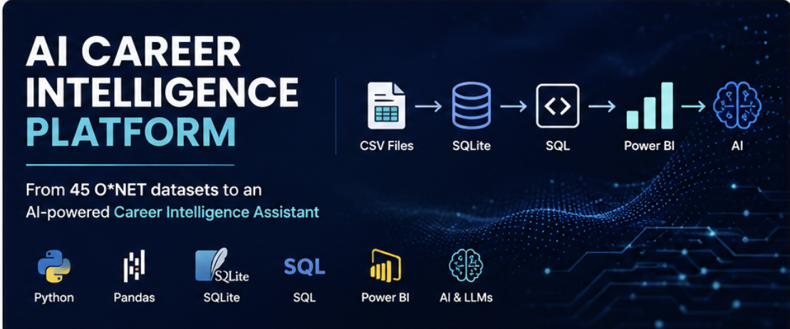
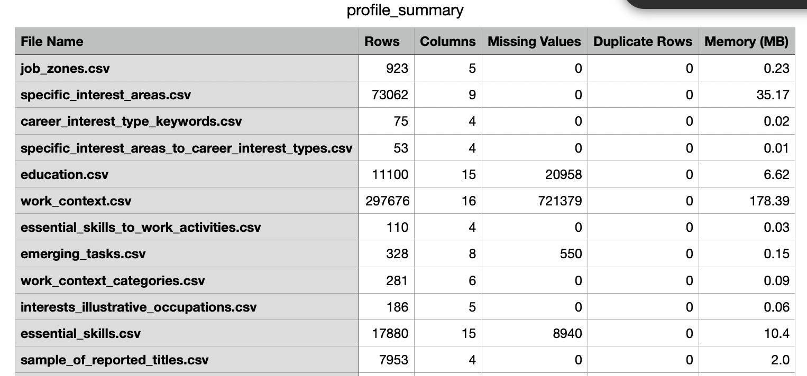
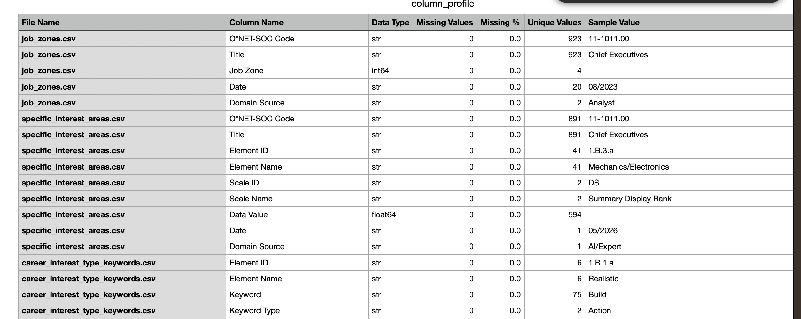

# 🚀 AI Career Intelligence Platform




> Transforming 41 O*NET datasets into an AI-powered Career Intelligence Platform using Python, SQL, SQLite, Power BI, Retrieval-Augmented Generation (RAG), and Large Language Models.

---

# 📌 Project Vision

Choosing a career shouldn't require searching through hundreds of web pages.

The goal of this project is to transform the official **O*NET occupational database** into an intelligent career assistant capable of answering questions such as:

- What skills are required for a Data Scientist?
- Which occupations are most similar?
- What career path should I follow?
- Which skills should I learn next?
- What jobs best align with my interests?

Rather than jumping straight into AI, this project focuses on building a strong data foundation first. Every stage—from data profiling to database design, analytics, and AI—is being developed incrementally using software engineering best practices.

---

# 🏗 Current Architecture

```text
                  O*NET CSV Files
                         │
                         ▼
              Automated Data Profiling
                         │
                         ▼
             Data Quality Validation
                         │
                         ▼
              SQLite ETL Pipeline
                         │
                         ▼
             SQLite Relational Database
                  (41 Tables)
                         │
                         ▼
                SQL Analytics Layer
                         │
                         ▼
               Power BI Dashboards
                         │
                         ▼
        AI Career Intelligence Assistant
```

---

# 📂 Project Structure

```text
AI-Career-Intelligence/
│
├── assets/
│   ├── banner.png
│   ├── profile-summary.png
│   └── column-profile.png
│
├── data/
│   ├── raw/
│   ├── processed/
│   └── database/
│
├── outputs/
│   ├── profile_summary.csv
│   └── column_profile.csv
│
├── src/
│   ├── config.py
│   ├── loader.py
│   ├── profiler.py
│   ├── database.py
│   └── main.py
│
├── README.md
├── requirements.txt
└── .gitignore
```

---

# 🚀 Project Status

| Milestone | Status |
|------------|--------|
| Project Setup | ✅ Complete |
| Modular Python Architecture | ✅ Complete |
| Automated CSV Discovery | ✅ Complete |
| File-Level Data Profiling | ✅ Complete |
| Column-Level Data Profiling | ✅ Complete |
| Missing Value Analysis | ✅ Complete |
| Duplicate Detection | ✅ Complete |
| Automated Report Generation | ✅ Complete |
| SQLite ETL Pipeline | ✅ Complete |
| SQLite Database (41 Tables) | ✅ Complete |
| SQL Analytics Layer | 🚧 In Progress |
| Power BI Dashboards | ⏳ Planned |
| Retrieval-Augmented Generation (RAG) | ⏳ Planned |
| AI Career Intelligence Assistant | ⏳ Planned |

---

# 📊 Project Output

The Python profiling pipeline automatically analyzes every O*NET dataset and generates comprehensive profiling reports.

## File-Level Data Profiling

The pipeline reports:

- Number of rows
- Number of columns
- Missing values
- Duplicate rows
- Memory usage



---

## Column-Level Data Profiling

The pipeline also profiles every column, including:

- Data type
- Missing values
- Missing percentage
- Unique values
- Sample values



---

# 🗄 SQLite Database

The project now includes a complete ETL pipeline that automatically converts the raw O*NET CSV datasets into a relational SQLite database.

Current capabilities include:

- Automatic SQLite database creation
- Loading all **41** datasets into relational tables
- Rebuilding the database whenever the pipeline is executed
- Providing the foundation for SQL analytics and future AI applications

This milestone marks the completion of the project's first end-to-end ETL pipeline.

---

# 🚀 Getting Started

## Clone the repository

```bash
git clone https://github.com/sgaind-data/AI-Career-Intelligence.git
cd AI-Career-Intelligence
```

## Install dependencies

```bash
pip install -r requirements.txt
```

## Run the project

```bash
python src/main.py
```

Running the pipeline will automatically:

- Discover all O*NET datasets
- Generate data profiling reports
- Build a SQLite database
- Populate 41 relational tables

---

# 🛠 Tech Stack

## Languages

- Python
- SQL

## Data Processing

- Pandas
- SQLite

## Analytics & Visualization

- Power BI *(planned)*

## Artificial Intelligence

- Retrieval-Augmented Generation (RAG) *(planned)*
- Large Language Models *(planned)*
- FastAPI *(planned)*

## Development

- Git
- GitHub

---

# 🎯 Project Goals

This project demonstrates an end-to-end modern data and AI workflow, including:

- Data Engineering
- ETL Pipeline Development
- Data Profiling
- Relational Database Design
- SQL Analytics
- Business Intelligence
- Retrieval-Augmented Generation (RAG)
- AI Application Development
- Software Engineering Best Practices

---

# 🚀 Upcoming Milestones

- ✅ Data Profiling
- ✅ SQLite ETL Pipeline
- ⏳ SQL Analytics
- ⏳ Data Warehouse Views
- ⏳ Power BI Dashboards
- ⏳ Semantic Search
- ⏳ Vector Database
- ⏳ Retrieval-Augmented Generation (RAG)
- ⏳ AI Career Intelligence Assistant
- ⏳ FastAPI Deployment

---

# 🤝 Build in Public

This repository is being developed publicly from the ground up.

Rather than showcasing only the finished product, every milestone—from raw occupational datasets to a fully functional AI Career Intelligence Platform—is documented through GitHub commits and LinkedIn updates.

The goal is to share not only **what** was built, but also **how** it was built, the challenges encountered, and the engineering decisions made along the way.

If you're interested in AI, Data Science, Data Engineering, Analytics, or Software Engineering, feel free to follow the journey, share feedback, or contribute ideas.

⭐ If you find this project interesting, consider giving it a star.